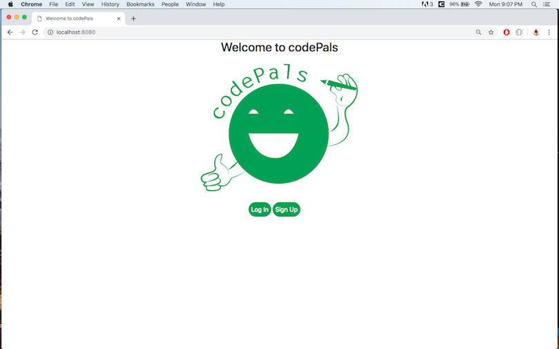
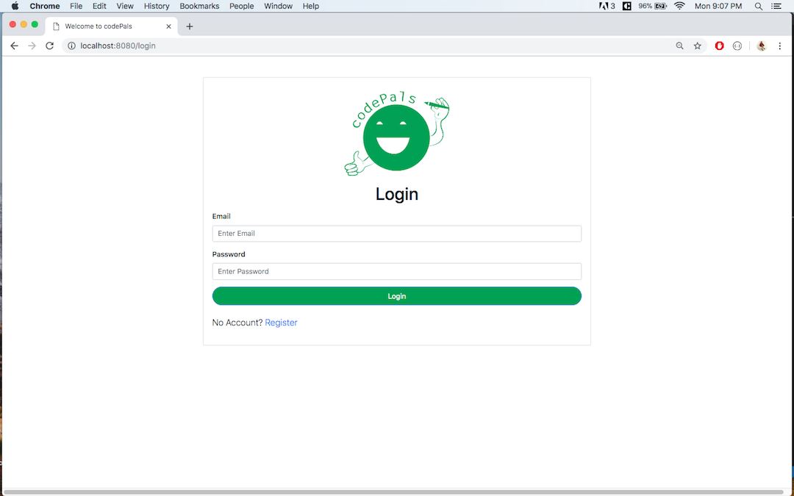
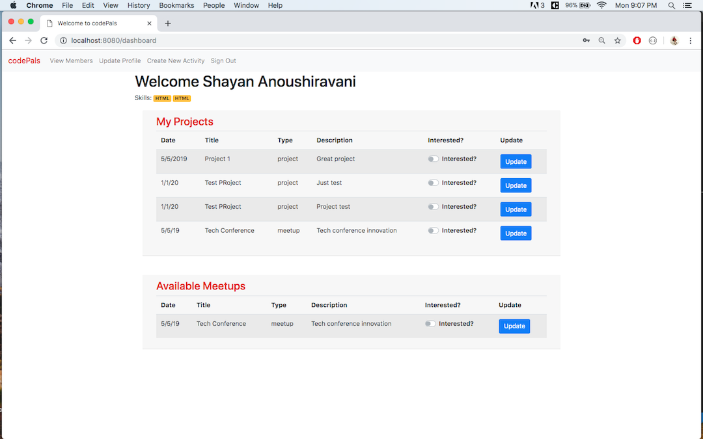
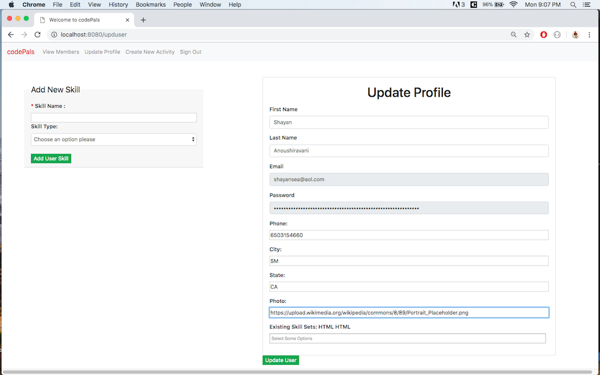

# codePals
## <a name="introduction"> Introduction </a>
<hr />
Fullstack Appplication Node server Express &amp; mysql. 
This application will help coonnect people with want to come together to create a usable software , endless possibilties to create an amazing network of people around. 

This app is one spot hub to share information related to tech meetups for codePlas to broswer through the events and slect if they are interested or not. 

<!--  -->






## Table of Content
+ [Introduction](#introduction)
+ [Getting Started](#gettingstarted)
+ [Authentication](#authentication)

## <a name="gettingstarted"> Getting Started </a>
<hr/>
These instructions will get you a copy of the project up and running on your local machine for development and testing purposes.

## Prerequisites

What things you need installed before running this application.

+ [Node](https://nodejs.org/en/download/)
+ [npm](https://docs.npmjs.com/cli/install)
+ [MySQL](https://dev.mysql.com/downloads/windows/installer/8.0.html)

<!-- I feel like the snippet below is not needed- Samuel -->

    npm install 
    npm install sequelize 
    npm install mysql2
    npm install express 
    npm install express-handlebars 
    npm install passport
    npm install bcryptjs
    -- npm install dotenv --save

```
    npm install 

    install dependencies that are located in package.json

    "dependencies": {
        "bcryptjs": "^2.4.3",
        "body-parser": "^1.18.3",
        "express": "^4.16.4",
        "express-handlebars": "^3.0.2",
        "express-session": "^1.16.1",
        "mysql2": "^1.6.5",
        "passport": "^0.4.0",
        "passport-local": "^1.0.0",
        "sequelize": "^5.3.0"
    }
```


## Demo Link 
<hr /> 

## Built With 
1. Node Packages 
    * Express - Node.js web application framework
     * Express Handlebars 
     * Passport - authentication for Node.js
     * Sequelize - promise-based ORM for Node.js
     * bcrypt - Encrypt password when save in database.
    
 2. HTML
    * CSS - custom css style 
    * Bootstrap + Chosen   - The CSS framework used.


## Features 
<hr/> 

## <a name="authentication"> Authentication </a>
+ Signup and Login 
    + signup and login are done through local-strategy authentication provided by passport.js which uses some form of username (we customized to email) and password to authenticate user.
    + Once authenticated, user can access other feature of the application.
    + Information unique to the user that are stored in the database can be retrieved once users log in  
    + users' passwords that are stored in the are encrypted with bcryptejs authentication process also use bcrypte to decrypte password for comparison user input of password and encrypted password stored in our database

The codes below is used to create a new strategy for signup for an account that can be use for authentication of session. It takes in the email information from our database as the username field and the passw for the password field. First thing this strategy does is that it will do a query in our database to check if user's email is already registered. If it is, it will throw a custome error. If it is not, the function will run a query to create a new data set with all the user information that the user has input in the front-end form. 

*The log in strategy code is very similar to this.

```
passport.use("local-signup", new LocalStrategy({
    usernameField: "email",
    passwordField: "passw",
    passReqToCallback: true 
  },

    function (req, email, passw, done) {
      process.nextTick(function () {
        db.users.findOne({
          where: {
            email: email
          }
        }).then(function (user, err) {
          console.log("Hi User", user)
          
          if (user) {
            return done(null, false, { 
              from: "signup",
              message: 'This email is already registered.' 
            });
          } else {
            db.users.create({
              firstName: req.body.firstName,
              lastName: req.body.lastName,
              email: email,
              phone: req.body.phone,
              city: req.body.city,
              state: req.body.state,
              passw: db.users.generateHash(passw)
            }).then(function (newUser) {
              return done(null, newUser)
            }).catch(err => console.log(err))
          }
        })
      })

    }))
```

Code snippets 


### Contributors: 
* Samuel Yu
* Halina Zmachynskaya
* Namita Shenai 
* Shayan Anoushiravani
* Nadire Ghalip